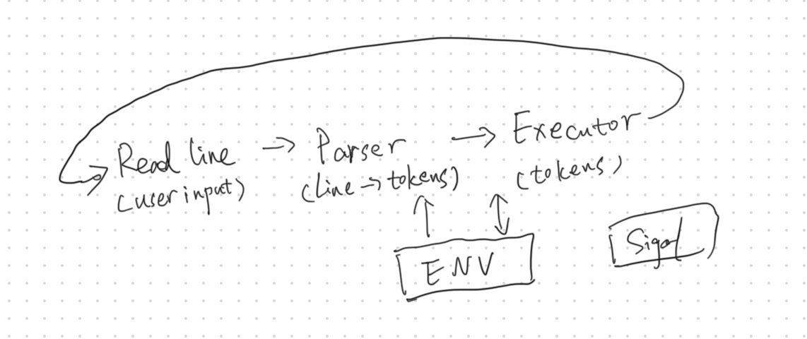
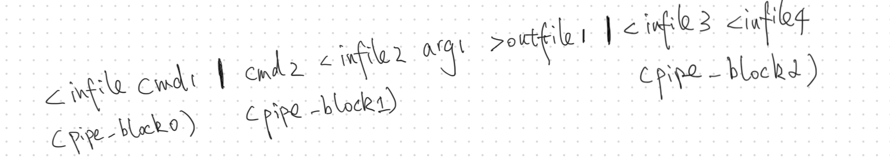
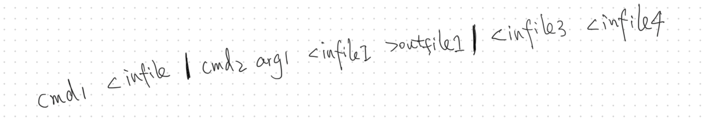
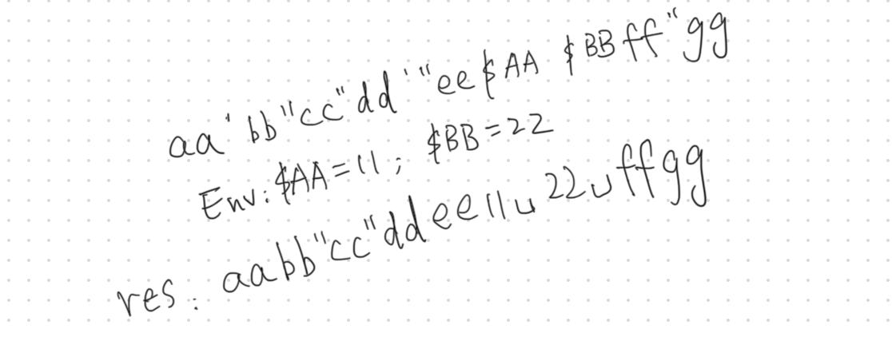

# Mini-Shell

Thanks to [@Abdul](https://github.com/IbnBaqqi) for working with me on this project.

## Overview

Mini-Shell is a simplified version of the Linux shell that follows the POSIX protocol. We divided this project into two main tasks and three support tasks:
According my other [42 projects](https://github.com/danielxfeng/42cursus), this is still a OOP styled C implementation.

- **Parser**: Parses user inputs and generates tokens for the `executor`.
- **Executor**: Executes the tokens parsed by the `parser`.
----
- **Env**: Since `setenv` is disabled in this project, we needed to maintain a custom environment as a support library.
- **Signal**: Handles system signals, [@Abdul](https://github.com/IbnBaqqi) did most of the work.
- **Readline**: We use the `readline` library to build a command-line interface, which we call in an infinite loop.



## Data Structure

### Simplified Vector (ArrayList in JAVA)

We implemented a simplified vector for the `parser` and `env`, which includes an auto-expander approach. However, the auto-shrink feature is missing. Since it's not a performance bottleneck, we did not implement `deque` features, so operations like `pop-front` and `insert-front` could be slow.

```c
typedef struct vector
{
    void    *data;
    int     size;
    int     capacity;
}  t_vector;
```

### AST (Abstract Syntax Tree)

We still applied the binary tree structure to our `executor`. For more information, please check my explanation in the [pipe_x project](https://github.com/danielxfeng/42cursus/blob/main/blog/pipex.md).

```c
typedef struct s_ast
{
	t_ast_node				*root;
	char					**tokens;
	int					tk_size;
	int					fd_in;
	int					fd_out;
	t_env					*env;
}						t_ast;

typedef struct s_ast_node
{
	t_node_type				type;
	void					*prop;
	int					(*node_pre_handler)(t_ast *ast, t_ast_node *node);
	int					(*node_handler)(t_ast *ast, t_ast_node *node);
	void					(*node_closer)(t_ast_node *ast_node);
	void					(*node_printer)(t_ast *ast, t_ast_node *n,
							t_ast_node *c, int l);
	t_ast_node				*left;
	t_ast_node				*right;
}							t_ast_node;
```

## Parser

Compared to the `Executor`, the `Parser` involves more hard-coded programming. We summarized several rules before implementation:

### General Rules

- We need to break one input `command` into several `pipe-blocks`.

- Each `pipe-block` should contain at most one `command`. Other tokens will be treated as `arguments`, and their order may not be correct.
- Each `pipe-block` can have several `redirection` tokens, but each `redirection` token should be followed by a `file` argument.
- Each `pipe` sign must be accompanied by a `left` child and a `right` child.


We also set up our custom rules to support our `executor`:
- In one `pipe-block`, if there is a `command`, it should be the first token, followed by all the arguments. To handle this, we implemented a `re-order-tokens` function.

- All `quotes` and `env expanders` are handled at this stage.


### Structure

We used a struct to represent a token.

```c
typedef struct s_token
{
    char            *data;
    t_token_type    type;
    int             pipe_idx;   // index of pipe_block.
    bool            is_end;     // for expander and quote handler
    bool            is_quote; 
} t_token;
```

### State Machine

We implemented a state machine to handle the `parser`, this approach likes what I did in [Project printf](https://github.com/danielxfeng/42cursus/tree/main/src/ft_printf).
```c
int    parse(t_parser *parser)
{
    char c;
    int status;
    
    while(true)
    {
        c = parser->line[parser->i];
        if (c == ' ')
		    status = parser_handle_space(parser);
        else if (c == '|')
            status =parser_handle_pipe(parser);
        else if (c == '<' || c == '>')
            status =parser_handle_red(parser);
        else if (c == '$')
            status =parser_handle_expander(parser);
        else if (c == '\"')
            status = parser_handle_double_quote(parser);
        else if (c == '\'')
            status = parser_handle_single_quote(parser);
        else if (c == '\0')
            return (parser_handle_end(parser)); 
        else
            status = parser_handle_normal(parser);
        if (status != EXIT_SUCCESS)
            return (status);
    }
}
```

## Executor

### Building the Tree

For building the AST, we applied a similar approach as the `divide phase` of the [merge sort algorithm](https://www.geeksforgeeks.org/merge-sort/) to build the AST recursively and effectively.

```c
// Expamle:
// cmd param1 < infile1 < infile2 > outfile0 | cmd2 | cmd3 > outfile1 | cmd4 > outfile2 > outfile3
//                                         Pipe3
//                              /                      /
//                            Pipe2              Red(> outfile3)
//                       /       /                   /
//                   Pipe1     Red(> outfile1)   Red(> outfile2)
//                   /   /         /                /
//       Red(> outfile0)  Cmd2    Cmd3             Cmd4
//         /
//    Red(< infile2)
//      /
//  Red(> infile1)
//   /
//  Cmd param1
```

### Pre-order, Post-order Tree Traversal

We continued to use the mixed [pre-order](https://www.geeksforgeeks.org/preorder-traversal-of-binary-tree/) and [post-order](https://www.geeksforgeeks.org/postorder-traversal-of-binary-tree/) traversal structure I used in the [pipe_x project](https://github.com/danielxfeng/42cursus/blob/main/blog/pipex.md) to execute the tree. Most logic is similar, except for the `redirection` node.

### Redirection Node

Different from the `redirection` node in `pipe_x`, in Mini-Shell we need to handle redirection inputs like:
```shell
< infile1 > outfile1 < infile2 > outfile2
```

For this example, all four files will be opened initially, but only `infile2` and `outfile2` will be redirected.

To support this, a `Post-order` traversal is added before execution to open the files, and during execution, we added another `Pre-order` traversal to skip the left redirections in one pipe-block.
